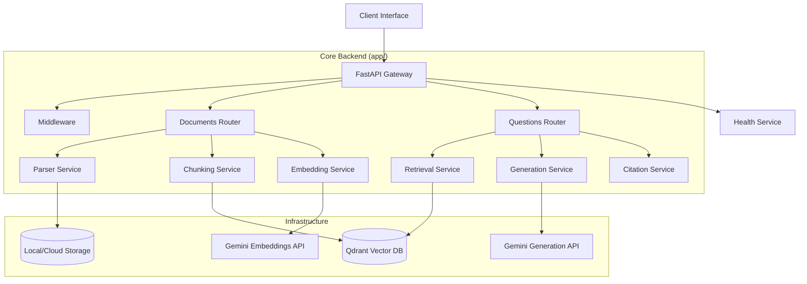
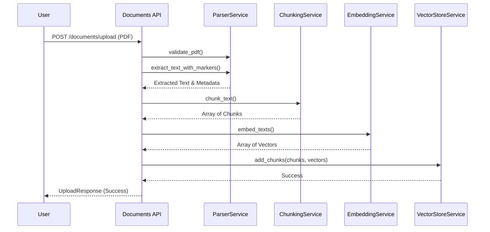
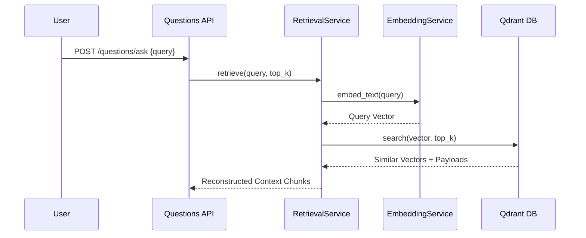
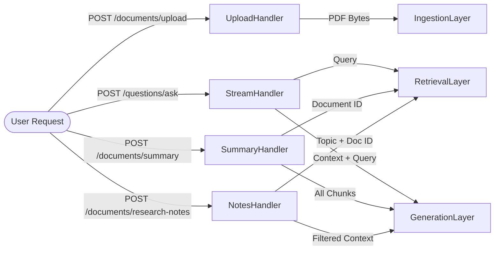
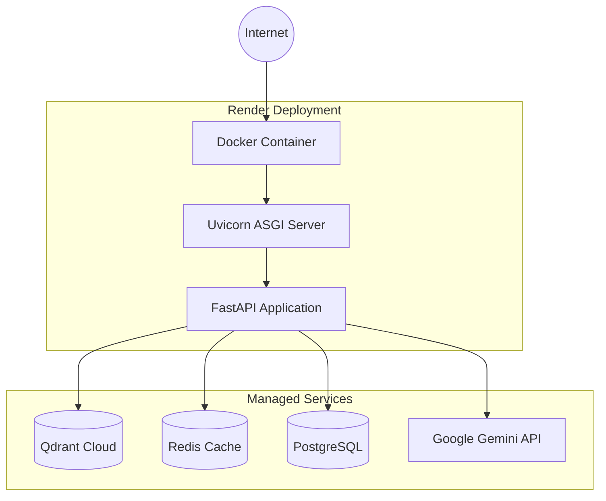

# Architecture Documentation

## 1. System Architecture Diagram

```mermaid
graph TD
    Client[Client Interface] --> API[FastAPI Gateway]
    
    subgraph "Core Backend (app/)"
        API --> Auth[Middleware]
        API --> Docs[Documents Router]
        API --> Chat[Questions Router]
        
        Docs --> PS[Parser Service]
        Docs --> CS[Chunking Service]
        Docs --> ES[Embedding Service]
        
        Chat --> RS[Retrieval Service]
        Chat --> GS[Generation Service]
        Chat --> CitS[Citation Service]
    end
    
    subgraph "Infrastructure"
        ES --> LLM1[Gemini Embeddings API]
        GS --> LLM2[Gemini Generation API]
        
        PS --> FS[(Local/Cloud Storage)]
        RS --> QD[(Qdrant Vector DB)]
        CS --> QD
    end
    
    API --> HS[Health Service]
```

## 2. Ingestion Pipeline Diagram

```mermaid
sequenceDiagram
    participant User
    participant API as Documents API
    participant PS as ParserService
    participant CS as ChunkingService
    participant ES as EmbeddingService
    participant VS as VectorStoreService
    
    User->>API: POST /documents/upload (PDF)
    API->>PS: validate_pdf()
    API->>PS: extract_text_with_markers()
    PS-->>API: Extracted Text & Metadata
    
    API->>CS: chunk_text()
    CS-->>API: Array of Chunks
    
    API->>ES: embed_texts()
    ES-->>API: Array of Vectors
    
    API->>VS: add_chunks(chunks, vectors)
    VS-->>API: Success
    
    API-->>User: UploadResponse (Success)
```

## 3. Retrieval Pipeline Diagram

```mermaid
sequenceDiagram
    participant User
    participant API as Questions API
    participant RS as RetrievalService
    participant ES as EmbeddingService
    participant QD as Qdrant DB
    
    User->>API: POST /questions/ask {query}
    
    API->>RS: retrieve(query, top_k)
    RS->>ES: embed_text(query)
    ES-->>RS: Query Vector
    
    RS->>QD: search(vector, top_k)
    QD-->>RS: Similar Vectors + Payloads
    
    RS-->>API: Reconstructed Context Chunks
```

## 4. API Flow Diagram

```mermaid
graph LR
    User([User Request])
    
    User --> |POST /documents/upload| UploadHandler
    User --> |POST /questions/ask| StreamHandler
    User --> |POST /documents/summary| SummaryHandler
    User --> |POST /documents/research-notes| NotesHandler
    
    UploadHandler --> |PDF Bytes| IngestionLayer
    StreamHandler --> |Query| RetrievalLayer
    StreamHandler --> |Context + Query| GenerationLayer
    
    SummaryHandler --> |Document ID| RetrievalLayer
    SummaryHandler --> |All Chunks| GenerationLayer
    
    NotesHandler --> |Topic + Doc ID| RetrievalLayer
    NotesHandler --> |Filtered Context| GenerationLayer
```

## 5. Deployment Diagram

```mermaid
graph TD
    subgraph "Render Deployment"
        DockerContainer[Docker Container]
        Uvicorn[Uvicorn ASGI Server]
        FastAPI[FastAPI Application]
        
        DockerContainer --> Uvicorn
        Uvicorn --> FastAPI
    end
    
    subgraph "Managed Services"
        Qdrant[(Qdrant Cloud)]
        Redis[(Redis Cache)]
        Postgres[(PostgreSQL)]
        Gemini[Google Gemini API]
    end
    
    FastAPI --> Qdrant
    FastAPI --> Redis
    FastAPI --> Postgres
    FastAPI --> Gemini
    
    Internet((Internet)) --> DockerContainer
```
